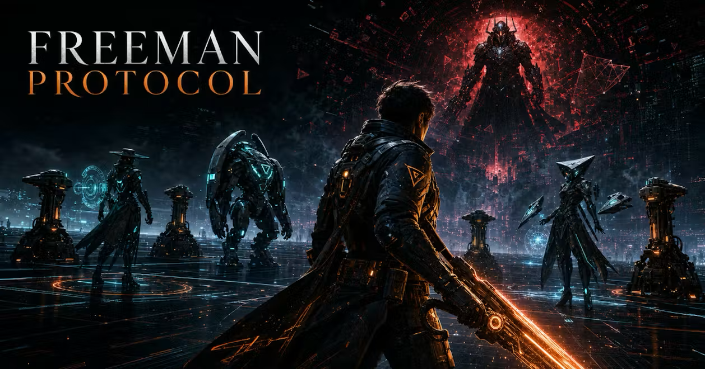
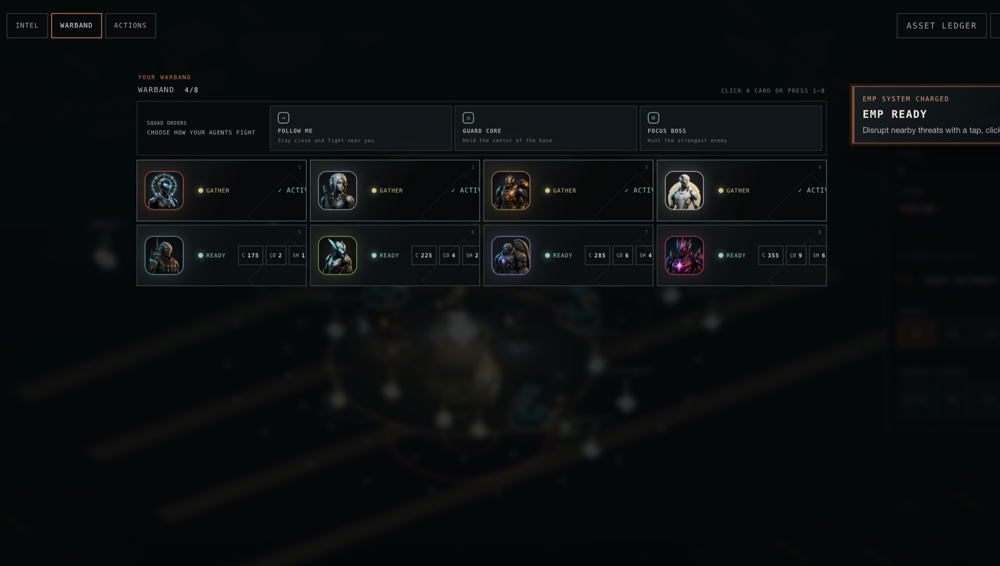
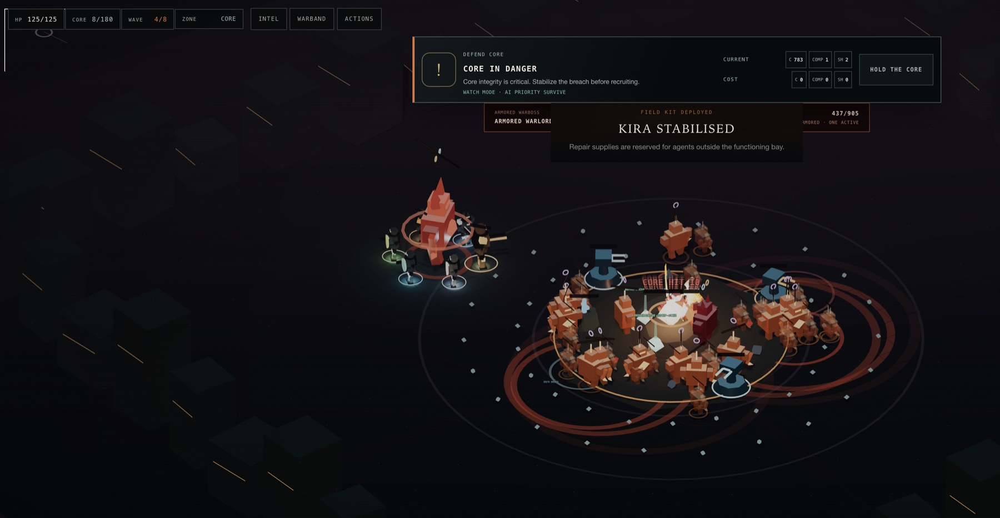
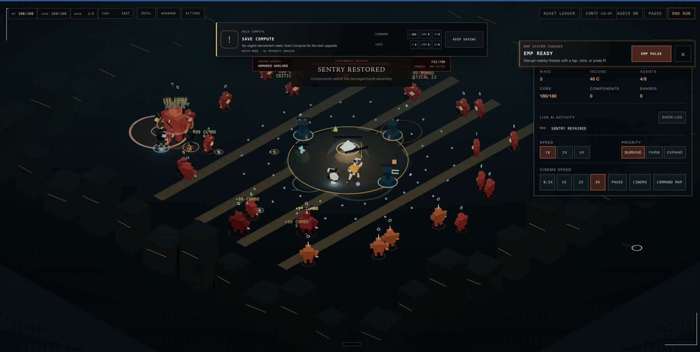
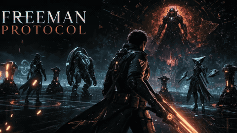

<div align="center">
  

  <h1>Freeman Protocol</h1>

  <p><strong>Build an autonomous AI warband. Defend the Core. Survive the breach.</strong></p>

  <p>
    <a href="https://freeman.skillrivals.com/">Play the live game</a>
    &nbsp;·&nbsp;
    <a href="https://freeman.skillrivals.com/video/freeman-protocol-trailer.mp4">Play the trailer</a>
    &nbsp;·&nbsp;
    <a href="https://youtu.be/SesS1bd7b4c">YouTube</a>
    &nbsp;·&nbsp;
    <a href="https://freeman.skillrivals.com/asset-catalog">Browse the asset catalog</a>
  </p>

  <p>
    
    
    
  </p>
</div>

Freeman Protocol is a cinematic browser strategy-action game about turning a handful of resources into a living AI defense network. You fight when you want to, manage the warband when you need to, and can hand the whole operation to your agents in Watch Mode.

## The five-minute loop

<table>
  <tr>
    <td align="center" width="20%"><strong>01<br />GATHER</strong><br /><sub>Collect Compute, Components, and Shards.</sub></td>
    <td align="center" width="20%"><strong>02<br />RECRUIT</strong><br /><sub>Fill the eight-slot warband with specialists.</sub></td>
    <td align="center" width="20%"><strong>03<br />REPAIR</strong><br /><sub>Keep agents, sentries, and the Core online.</sub></td>
    <td align="center" width="20%"><strong>04<br />DEPLOY</strong><br /><sub>Use skills, EMP, loot, and temporary sub-agents.</sub></td>
    <td align="center" width="20%"><strong>05<br />SURVIVE</strong><br /><sub>Hold the breach through escalating boss waves.</sub></td>
  </tr>
</table>

## Why it feels different

<table>
  <tr>
    <td width="33%"><strong>Autonomous AI warband</strong><br /><sub>Recruit distinct agents, give them a broad priority, and watch them gather, fight, repair, and improvise.</sub></td>
    <td width="33%"><strong>Living battlefield</strong><br /><sub>Defend a meaningful Core while breach lanes, compute nodes, repair bays, loot, and boss portals pull the action outward.</sub></td>
    <td width="33%"><strong>Watch Mode</strong><br /><sub>Let your network run itself, earn income, spawn support, and turn a campaign into an endless idle-farming command view.</sub></td>
  </tr>
</table>

## See the network in action

<table>
  <tr>
    <td align="center" width="50%">
      <strong>Recruit a specialist warband</strong><br />
      
    </td>
    <td align="center" width="50%">
      <strong>Hold the Core under pressure</strong><br />
      
    </td>
  </tr>
  <tr>
    <td align="center" colspan="2">
      <strong>Time the EMP and let the autonomous network push the lanes</strong><br />
      
    </td>
  </tr>
</table>

## Trailer

<div align="center">
  <a href="https://freeman.skillrivals.com/video/freeman-protocol-trailer.mp4">
    
  </a>
  <p>
    <a href="https://freeman.skillrivals.com/video/freeman-protocol-trailer.mp4"><strong>Play the full trailer</strong></a>
    &nbsp;·&nbsp;
    <a href="https://youtu.be/SesS1bd7b4c">YouTube</a>
  </p>
  <p><sub>The animated preview plays inline. GitHub does not render YouTube iframes inside README files, so the full MP4 and YouTube versions are linked above.</sub></p>
</div>

## Current build

| Surface | Status |
| --- | --- |
| Campaign | Playable through escalating breach waves and boss encounters |
| Watch Mode | Playable; agents gather, repair, fight, and generate income autonomously |
| Desktop + mobile | Supported with simplified touch controls and readable HUD states |
| Co-op | Coming soon; the lobby activates after a production WebSocket room Worker is configured |

## Developer setup

<details>
<summary>Runtime, prerequisites, and local commands</summary>

Freeman Protocol is a full-stack browser app running on [vinext](https://github.com/cloudflare/vinext), with optional Cloudflare D1 and Drizzle support.

**Prerequisites**

- Node.js `>=22.13.0`
- Linux with `flock`, `curl`, and GNU `timeout` for the Sites lifecycle scripts

**Commands**

```bash
npm run install:ci       # locked dependency install
npm run dev              # local Vite/Vinext preview
npm run build            # build and validate the deployable artifact
npm test                 # build, validate, and run the test suite
npm run validate:artifact
npm run db:generate
```

The Sites lifecycle runs the locked install before returning a checkout. Edit source under `app/`; the remote Sites builder runs `npm run build` against the pushed commit. The generated `.sites-runtime/` directory is disposable and ignored by Git.

</details>

<details>
<summary>Optional co-op multiplayer deployment</summary>

Co-op is intentionally feature-flagged. The browser enables the room lobby only when a public WebSocket endpoint is injected at build time. Set the canonical `CO_OP_WS_URL` environment variable to the `wss://` origin of the Worker serving `/api/co-op/rooms/:roomCode`. Deployments that only expose framework-prefixed client variables may use `NEXT_PUBLIC_CO_OP_WS_URL` instead. Never put a token or credential in either value. Do not commit `.env*` files or secret values.

The room Worker needs a Cloudflare Durable Object namespace binding named `CO_OP_ROOMS` pointing to the `MultiplayerRoom` class, plus the first Durable Object migration for that class. Provision the equivalent binding and migration in production before pointing the frontend at it. Keep `.openai/hosting.json` unchanged until the real production binding has been provisioned by the hosting platform.

If the WebSocket variable is absent, the lobby safely shows **CO-OP COMING SOON**. If a Worker is reached without `CO_OP_ROOMS`, its WebSocket room route returns `503` rather than attempting a broken upgrade. Campaign and Watch Mode continue to run without a network endpoint.

**Production checklist**

1. Deploy `worker/index.ts` and `worker/multiplayer-room.ts` with the `CO_OP_ROOMS` Durable Object binding and migration.
2. Confirm `GET /api/co-op/rooms/ABC123` upgrades to WebSocket only after the binding is present.
3. Set `CO_OP_WS_URL` in the frontend build environment, redeploy, and verify the lobby no longer shows **CO-OP COMING SOON**.
4. Keep all credentials in the hosting provider's secret store.

</details>

<details>
<summary>Included project shape and authentication notes</summary>

- Edit site code under `app/`.
- `app/chatgpt-auth.ts` provides optional dispatch-owned ChatGPT sign-in helpers.
- `.openai/hosting.json` declares optional Sites D1 and R2 bindings.
- `vite.config.ts` simulates declared bindings for local development.
- `db/index.ts` reads the D1 binding from the Cloudflare Worker environment.
- `db/schema.ts` starts intentionally empty; `examples/d1/` contains an optional D1 example surface.

OpenAI workspace Sites can read the current user's email from `oai-authenticated-user-email`. SIWC-authenticated Sites may also receive `oai-authenticated-user-full-name` and `oai-authenticated-user-full-name-encoding: percent-encoded-utf-8`. Use `getChatGPTUser()` for optional signed-in UI or `requireChatGPTUser(returnTo)` for protected pages; leave public game content anonymous.

</details>

## Learn more

- [Live game](https://freeman.skillrivals.com/)
- [Asset catalog](https://freeman.skillrivals.com/asset-catalog)
- [Freeman Protocol trailer](https://youtu.be/SesS1bd7b4c)
- [vinext documentation](https://github.com/cloudflare/vinext)
- [Drizzle D1 guide](https://orm.drizzle.team/docs/get-started/d1-new)
